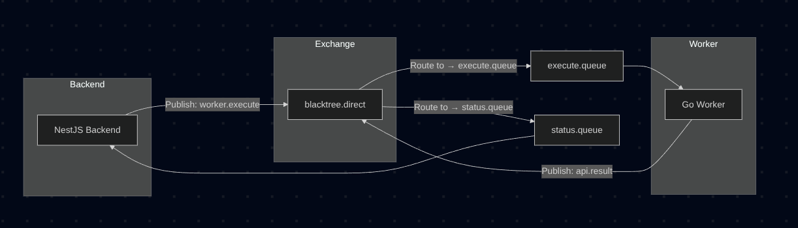

---
## Backend Architecture (Control plane)
### Users Module
- Users can signup and signin using Clerk and OAuth.
- Users can connect to their GitHub account using OAuth scope `public repo` and `email` access.
- Users can view their connected GitHub account and its status.
- Users can get their profile information.
- Users can update their profile information.
- Users can delete their account. (not implemented yet)

### Deployment Module
- Users can select a repository, branch, and Dockerfile path from their connected GitHub account.
- Users can upload environment variables. (not implemented yet)
- Users can update their deployment configuration.
- Users can select the endpoints for the backend hosted.
- Users can update the endpoints for the backend hosted.
- Users can delete the endpoints for the backend hosted.

### Messaging-Queue Module
- Deployment trigger for creating and publishing messages to the queue.
- Messaging Service layer
    - Create the exchange and queue in RabbitMQ.
    - Create a publishdeploymentdto to publish the deployment message.
    - OnModuleInit to create the exchange and queue.
    - OnModuleDestroy to delete the exchange and queue.
    - Publish method to publish the deployment message.
- Create a persistent volume for rabbitmq and docker compose setup.

---

## MQ Architecture (Rabbitmq)
- Implemented direct queue
- exchangeName : "blacktree.direct"

| Direction        | Exchange           | Routing Key      | Queue           | Producer | Consumer |
| ---------------- | ------------------ | ---------------- | --------------- | -------- | -------- |
| backend → worker | `blacktree.direct` | `worker.execute` | `execute.queue` | API      | Worker   |
| worker → backend | `blacktree.direct` | `api.result`     | `status.queue`  | Worker   | API      |

---
## Worker (Go)
- Can clone the github repo based on the deployment request
- Can build the image based on the docker
- Can host the image on docker engine and can stop it or restart it.
- Publish the status of the updates when changes are done on messaging queue
- Can consume and publish from the messaging queue

The different packages of the workers
- git: clone.go, 