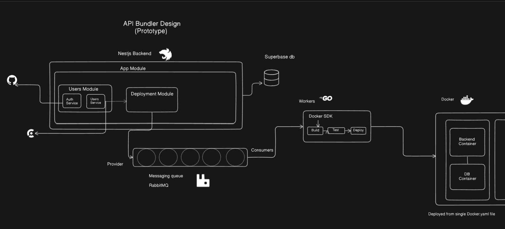

# Designing Deployment Strategies
so studied some design patterns for deloyment and come with conclusions

## Local dev
for local development, we can use a simple docker-compose setup that includes the necessary services like the database and any other dependencies. This allows developers to run the application in an environment that closely resembles production.

I see I have completed user-module, deployment-module and mq-module. All working according to [[../architecture/stages/AB-1.Structure.md]]. 

Now working on worker... 